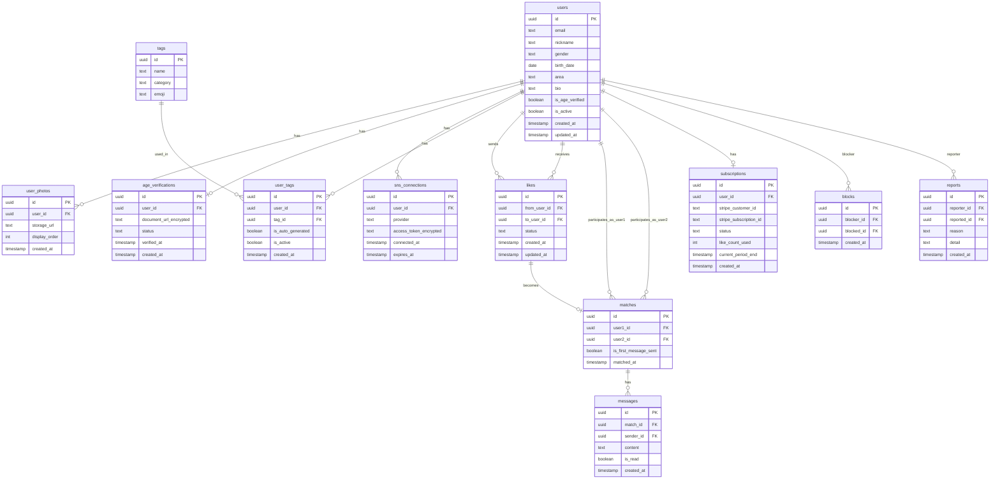

# データベース設計書 — Truener

---

## 1. 概要

- **DBMS:** PostgreSQL（Supabase管理）
- **文字コード:** UTF-8
- **タイムゾーン:** UTC（アプリ層で JST 変換）
- **セキュリティ:** Row Level Security（RLS）を全テーブルに有効化
- **命名規則:** テーブル名・カラム名は `snake_case`

---

## 2. ER図（Mermaid）



---

## 3. テーブル定義

### 3.1 `users` — ユーザー基本情報

| カラム名 | データ型 | 制約 | 説明 |
|----------|----------|------|------|
| id | `uuid` | PK, DEFAULT `gen_random_uuid()` | ユーザーID（Supabase Auth の `auth.users.id` と同一） |
| email | `text` | NOT NULL, UNIQUE | Googleアカウントのメールアドレス |
| nickname | `text` | NOT NULL | 表示名（ニックネーム） |
| gender | `text` | NOT NULL, CHECK (`gender` IN ('male', 'female')) | 性別 |
| birth_date | `date` | NOT NULL | 生年月日（年齢計算に使用） |
| area | `text` | NOT NULL | 居住エリア（例: 東京都、神奈川県） |
| bio | `text` | | 自己紹介文（任意、最大500文字） |
| is_age_verified | `boolean` | NOT NULL, DEFAULT `false` | 年齢確認完了フラグ |
| is_active | `boolean` | NOT NULL, DEFAULT `true` | アカウント有効フラグ（退会時 `false`） |
| created_at | `timestamptz` | NOT NULL, DEFAULT `now()` | アカウント作成日時 |
| updated_at | `timestamptz` | NOT NULL, DEFAULT `now()` | 最終更新日時（トリガーで自動更新） |

**インデックス:**
```sql
CREATE INDEX idx_users_gender ON users(gender);
CREATE INDEX idx_users_area ON users(area);
CREATE INDEX idx_users_is_active ON users(is_active);
```

**RLSポリシー:**
```sql
-- 自分自身と、マッチング相手のプロフィールのみ閲覧可能
ALTER TABLE users ENABLE ROW LEVEL SECURITY;
CREATE POLICY "users_select" ON users FOR SELECT
  USING (
    auth.uid() = id
    OR id IN (
      SELECT user1_id FROM matches WHERE user2_id = auth.uid()
      UNION
      SELECT user2_id FROM matches WHERE user1_id = auth.uid()
    )
    -- マッチング候補閲覧（ホーム画面）はRLSではなくServer Componentで制御
  );
CREATE POLICY "users_update_own" ON users FOR UPDATE
  USING (auth.uid() = id);
```

---

### 3.2 `user_photos` — ユーザー写真

| カラム名 | データ型 | 制約 | 説明 |
|----------|----------|------|------|
| id | `uuid` | PK, DEFAULT `gen_random_uuid()` | 写真ID |
| user_id | `uuid` | NOT NULL, FK → `users.id` ON DELETE CASCADE | 対象ユーザーID |
| storage_url | `text` | NOT NULL | Supabase Storage のパブリックURL |
| display_order | `int` | NOT NULL, DEFAULT `0` | 表示順（0が先頭） |
| created_at | `timestamptz` | NOT NULL, DEFAULT `now()` | アップロード日時 |

**制約:** 1ユーザーにつき最大6枚（アプリ層で制御）

---

### 3.3 `age_verifications` — 年齢確認

| カラム名 | データ型 | 制約 | 説明 |
|----------|----------|------|------|
| id | `uuid` | PK, DEFAULT `gen_random_uuid()` | 年齢確認ID |
| user_id | `uuid` | NOT NULL, UNIQUE, FK → `users.id` | 対象ユーザーID（1人1件） |
| document_url_encrypted | `text` | NOT NULL | 年齢確認書類のStorage URL（暗号化） |
| status | `text` | NOT NULL, DEFAULT `'pending'`, CHECK IN (`'pending'`, `'approved'`, `'rejected'`) | 審査状態 |
| verified_at | `timestamptz` | | 審査完了日時 |
| created_at | `timestamptz` | NOT NULL, DEFAULT `now()` | 申請日時 |

**ビジネスルール:** `status = 'approved'` になると `users.is_age_verified` を `true` に更新するトリガーを設定

---

### 3.4 `sns_connections` — SNS連携情報

| カラム名 | データ型 | 制約 | 説明 |
|----------|----------|------|------|
| id | `uuid` | PK, DEFAULT `gen_random_uuid()` | 連携ID |
| user_id | `uuid` | NOT NULL, FK → `users.id` ON DELETE CASCADE | 対象ユーザーID |
| provider | `text` | NOT NULL, CHECK IN (`'instagram'`, `'twitter'`) | SNSプロバイダー |
| access_token_encrypted | `text` | NOT NULL | 暗号化されたアクセストークン |
| connected_at | `timestamptz` | NOT NULL, DEFAULT `now()` | 連携日時 |
| expires_at | `timestamptz` | | トークン有効期限 |

**制約:** `UNIQUE(user_id, provider)` — 1ユーザーにつき1プロバイダー1件

**セキュリティ:** `access_token_encrypted` はアプリケーション層で AES-256 暗号化してから保存

---

### 3.5 `tags` — タグマスター

| カラム名 | データ型 | 制約 | 説明 |
|----------|----------|------|------|
| id | `uuid` | PK, DEFAULT `gen_random_uuid()` | タグID |
| name | `text` | NOT NULL, UNIQUE | タグ名（例: 「音楽好き」） |
| category | `text` | NOT NULL | カテゴリ（例: 「趣味」「グルメ」「スポーツ」） |
| emoji | `text` | NOT NULL | 表示用絵文字（例: 🎵） |

**初期データ:** AIが生成したタグはこのテーブルにUPSERTされる

---

### 3.6 `user_tags` — ユーザー×タグ中間テーブル

| カラム名 | データ型 | 制約 | 説明 |
|----------|----------|------|------|
| id | `uuid` | PK, DEFAULT `gen_random_uuid()` | ID |
| user_id | `uuid` | NOT NULL, FK → `users.id` ON DELETE CASCADE | ユーザーID |
| tag_id | `uuid` | NOT NULL, FK → `tags.id` | タグID |
| is_auto_generated | `boolean` | NOT NULL, DEFAULT `false` | AI自動生成か手動追加か |
| is_active | `boolean` | NOT NULL, DEFAULT `true` | タグが有効か（削除は論理削除） |
| created_at | `timestamptz` | NOT NULL, DEFAULT `now()` | 追加日時 |

**制約:** `UNIQUE(user_id, tag_id)`

**インデックス:**
```sql
CREATE INDEX idx_user_tags_user_id ON user_tags(user_id) WHERE is_active = true;
```

---

### 3.7 `likes` — いいね（リクエスト）

| カラム名 | データ型 | 制約 | 説明 |
|----------|----------|------|------|
| id | `uuid` | PK, DEFAULT `gen_random_uuid()` | いいねID |
| from_user_id | `uuid` | NOT NULL, FK → `users.id` | いいね送信者（基本的に男性） |
| to_user_id | `uuid` | NOT NULL, FK → `users.id` | いいね受信者（基本的に女性） |
| status | `text` | NOT NULL, DEFAULT `'pending'`, CHECK IN (`'pending'`, `'approved'`, `'skipped'`) | 承認状態 |
| created_at | `timestamptz` | NOT NULL, DEFAULT `now()` | いいね送信日時 |
| updated_at | `timestamptz` | NOT NULL, DEFAULT `now()` | 状態更新日時 |

**制約:** `UNIQUE(from_user_id, to_user_id)` — 同一ペアに重複いいね不可

**ビジネスルール:** `status` が `'pending'` → `'approved'` に変更された際、`matches` テーブルにレコードをINSERTするトリガーを設定

---

### 3.8 `matches` — マッチング

| カラム名 | データ型 | 制約 | 説明 |
|----------|----------|------|------|
| id | `uuid` | PK, DEFAULT `gen_random_uuid()` | マッチングID |
| user1_id | `uuid` | NOT NULL, FK → `users.id` | ユーザー1（いいね送信者） |
| user2_id | `uuid` | NOT NULL, FK → `users.id` | ユーザー2（いいね受信者・女性） |
| is_first_message_sent | `boolean` | NOT NULL, DEFAULT `false` | 女性ファーストメッセージ送信済みか |
| matched_at | `timestamptz` | NOT NULL, DEFAULT `now()` | マッチング成立日時 |

**制約:** `UNIQUE(user1_id, user2_id)`

---

### 3.9 `messages` — チャットメッセージ

| カラム名 | データ型 | 制約 | 説明 |
|----------|----------|------|------|
| id | `uuid` | PK, DEFAULT `gen_random_uuid()` | メッセージID |
| match_id | `uuid` | NOT NULL, FK → `matches.id` ON DELETE CASCADE | マッチングID |
| sender_id | `uuid` | NOT NULL, FK → `users.id` | 送信者ユーザーID |
| content | `text` | NOT NULL | メッセージ本文（最大1000文字） |
| is_read | `boolean` | NOT NULL, DEFAULT `false` | 既読フラグ |
| created_at | `timestamptz` | NOT NULL, DEFAULT `now()` | 送信日時 |

**インデックス:**
```sql
CREATE INDEX idx_messages_match_id ON messages(match_id, created_at DESC);
```

**RLSポリシー:**
```sql
ALTER TABLE messages ENABLE ROW LEVEL SECURITY;
CREATE POLICY "messages_select" ON messages FOR SELECT
  USING (
    auth.uid() IN (
      SELECT user1_id FROM matches WHERE id = match_id
      UNION
      SELECT user2_id FROM matches WHERE id = match_id
    )
  );
CREATE POLICY "messages_insert" ON messages FOR INSERT
  WITH CHECK (auth.uid() = sender_id);
```

**Realtime設定:**
```sql
ALTER PUBLICATION supabase_realtime ADD TABLE messages;
```

---

### 3.10 `subscriptions` — 課金情報

| カラム名 | データ型 | 制約 | 説明 |
|----------|----------|------|------|
| id | `uuid` | PK, DEFAULT `gen_random_uuid()` | サブスクID |
| user_id | `uuid` | NOT NULL, UNIQUE, FK → `users.id` | ユーザーID（1人1件） |
| stripe_customer_id | `text` | NOT NULL, UNIQUE | Stripe顧客ID |
| stripe_subscription_id | `text` | UNIQUE | StripeサブスクID（課金前はNULL） |
| status | `text` | NOT NULL, DEFAULT `'free'`, CHECK IN (`'free'`, `'active'`, `'canceled'`, `'past_due'`) | 課金状態 |
| like_count_used | `int` | NOT NULL, DEFAULT `0` | 当月のいいね使用数（無料枠カウント用） |
| current_period_end | `timestamptz` | | サブスク期間終了日（課金中のみ） |
| created_at | `timestamptz` | NOT NULL, DEFAULT `now()` | 作成日時 |

---

### 3.11 `blocks` — ブロック

| カラム名 | データ型 | 制約 | 説明 |
|----------|----------|------|------|
| id | `uuid` | PK, DEFAULT `gen_random_uuid()` | ブロックID |
| blocker_id | `uuid` | NOT NULL, FK → `users.id` | ブロックしたユーザー |
| blocked_id | `uuid` | NOT NULL, FK → `users.id` | ブロックされたユーザー |
| created_at | `timestamptz` | NOT NULL, DEFAULT `now()` | ブロック日時 |

**制約:** `UNIQUE(blocker_id, blocked_id)`

---

### 3.12 `reports` — 通報

| カラム名 | データ型 | 制約 | 説明 |
|----------|----------|------|------|
| id | `uuid` | PK, DEFAULT `gen_random_uuid()` | 通報ID |
| reporter_id | `uuid` | NOT NULL, FK → `users.id` | 通報したユーザー |
| reported_id | `uuid` | NOT NULL, FK → `users.id` | 通報されたユーザー |
| reason | `text` | NOT NULL, CHECK IN (`'spam'`, `'harassment'`, `'fake'`, `'other'`) | 通報理由 |
| detail | `text` | | 詳細説明（任意） |
| created_at | `timestamptz` | NOT NULL, DEFAULT `now()` | 通報日時 |

---

## 4. マッチングスコア計算方針

マッチング候補の並び順は以下のスコアで決定する（アプリ層で計算）：

```
相性スコア = (共通タグ数 × 10) + 居住エリア一致ボーナス(+5) + 年齢差ボーナス（±5歳以内で+3）
```

- Server Component内でDBから取得後、TypeScript側でスコアを計算してソート
- 将来的にはDBのPostgreSQL関数やpg_vectorによるベクトル検索への移行を検討
