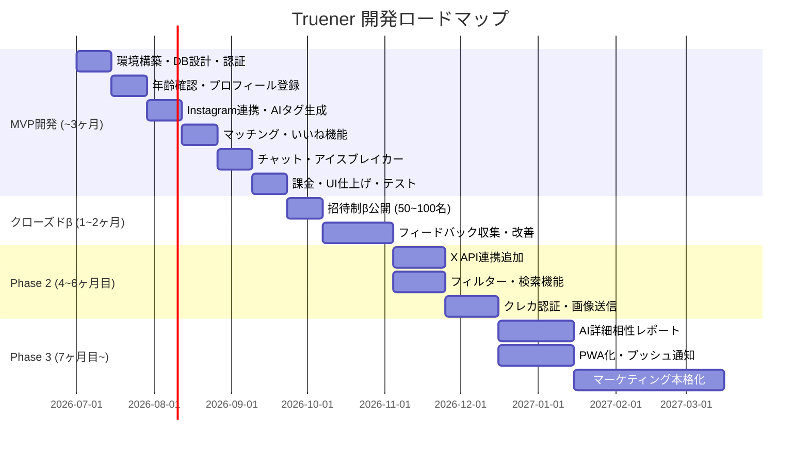

# 開発計画書 — Truener

---

## 1. 開発ロードマップ



---

## 2. フェーズ別目標

### Phase 1: MVP（〜3ヶ月）

**目標:** SNSタグマッチングというコアバリューが機能する最小構成をリリース

**成功条件:**
- 全機能が動作するWebアプリのデプロイ完了
- クローズドβ（招待制）ユーザー50〜100名の確保
- 致命的なバグゼロ

**主要デリバーブル:**
- Google認証 + 年齢確認フロー
- Instagram連携 + AIタグ自動生成
- マッチング（いいね・リクエスト承認制）
- 1対1チャット + AIアイスブレイカー
- Stripe課金（男性6,000円・女性無料）

---

### クローズドβ（MVPリリース後 1〜2ヶ月）

**目標:** 実ユーザーからの定量・定性フィードバックでコアバリューを検証

**検証する仮説:**
| 仮説 | 測定方法 | 目標値 |
|------|---------|--------|
| SNSタグで会話継続率が上がる | チャット3往復以上の割合 | 50%以上 |
| Instagram連携を使ってもらえる | SNS連携完了率 | 60%以上 |
| 女性が課金なしで定着する | 女性の1ヶ月継続率 | 40%以上 |

---

### Phase 2（4〜6ヶ月目）

**目標:** βフィードバックをもとに品質を向上させ、有料ユーザーを拡大

- X API v2 連携を追加（タグ精度向上）
- タグ・年齢・エリアのフィルター検索
- クレジットカード連携による信頼スコア
- チャット内画像送信

---

### Phase 3（7ヶ月目〜）

**目標:** 収益の多角化とユーザー数の本格拡大

- AI詳細相性分析レポート（有料オプション）
- PWA化（ホーム画面追加・プッシュ通知）
- マーケティング施策の本格化

---

## 3. WBS（タスク分解）— MVP

### 3.1 Week 1〜2: 開発環境構築・認証・DB

| タスクID | タスク | 工数目安 | 担当 |
|----------|--------|---------|------|
| T-001 | Next.js 14 App Router プロジェクト初期化（TypeScript + Tailwind） | 0.5日 | FE/BE |
| T-002 | Supabaseプロジェクト作成・環境変数設定 | 0.5日 | BE |
| T-003 | DBマイグレーション（全テーブル作成・RLS設定） | 1日 | BE |
| T-004 | Supabase Auth + Google OAuth 2.0 設定 | 1日 | FE/BE |
| T-005 | Next.js Middleware による認証ガード実装 | 0.5日 | FE/BE |
| T-006 | Vercel デプロイ設定・環境変数登録 | 0.5日 | BE |
| T-007 | TypeScript 型定義ファイル整備（database.ts等） | 0.5日 | FE/BE |
| T-008 | 登録フロー①基本情報入力画面 | 1日 | FE |

---

### 3.2 Week 3〜4: 年齢確認・プロフィール登録

| タスクID | タスク | 工数目安 | 担当 |
|----------|--------|---------|------|
| T-011 | 年齢確認書類アップロード画面（SCR-003） | 1日 | FE |
| T-012 | `/api/age-verify` Route Handler実装（Storageアップロード） | 1日 | BE |
| T-013 | 審査待ち画面（SCR-015）と審査通過後のフロー制御 | 0.5日 | FE |
| T-014 | 手動審査管理画面（管理者用・簡易版） | 1日 | FE/BE |
| T-015 | 登録フロー③SNS連携案内画面（SCR-004） | 0.5日 | FE |
| T-016 | 登録フロー⑤プロフィール作成画面（SCR-006） | 1日 | FE |
| T-017 | プロフィール写真アップロード（Supabase Storage） | 1日 | FE/BE |
| T-018 | `/api/auth/profile` Route Handler（プロフィール保存） | 0.5日 | BE |

---

### 3.3 Week 5〜6: Instagram連携・AIタグ生成

| タスクID | タスク | 工数目安 | 担当 |
|----------|--------|---------|------|
| T-021 | Instagram OAuth 設定（Meta Developer Console） | 1日 | BE |
| T-022 | Instagram Graph API データ取得ロジック実装 | 1日 | BE |
| T-023 | OpenAI API クライアント設定・プロンプト設計 | 1日 | BE |
| T-024 | `/api/tags/generate` Route Handler実装 | 1日 | BE |
| T-025 | タグ確認・修正画面（SCR-005） | 1日 | FE |
| T-026 | `TagEditor` コンポーネント実装（追加・削除UI） | 0.5日 | FE |
| T-027 | `/api/tags` PUT エンドポイント（タグ一括更新） | 0.5日 | BE |
| T-028 | タグ生成エラー時の手動入力フォールバック | 0.5日 | FE |

---

### 3.4 Week 7〜8: マッチング機能

| タスクID | タスク | 工数目安 | 担当 |
|----------|--------|---------|------|
| T-031 | マッチング候補一覧取得ロジック（相性スコア計算含む） | 1.5日 | BE |
| T-032 | ホーム画面（SCR-008）・`CandidateList` / `CandidateCard` 実装 | 1.5日 | FE |
| T-033 | プロフィール詳細画面（SCR-009）・共通点ハイライト実装 | 1日 | FE |
| T-034 | `/api/likes` POST Route Handler（課金チェック含む） | 1日 | BE |
| T-035 | `LikeButton` コンポーネント（アニメーション・課金チェック） | 0.5日 | FE |
| T-036 | いいねリクエスト一覧画面（SCR-010）— 女性専用 | 1日 | FE |
| T-037 | `/api/likes/[likeId]` PATCH Route Handler（承認・スキップ） | 0.5日 | BE |
| T-038 | マッチング成立通知（Supabase Realtime + UI） | 1日 | FE/BE |
| T-039 | ブロック・通報機能 UI + API | 0.5日 | FE/BE |

---

### 3.5 Week 9〜10: チャット・アイスブレイカー

| タスクID | タスク | 工数目安 | 担当 |
|----------|--------|---------|------|
| T-041 | Supabase Realtime チャット購読ロジック実装 | 1.5日 | FE/BE |
| T-042 | チャット一覧画面（SCR-011）・`ChatItem` コンポーネント | 1日 | FE |
| T-043 | チャット詳細画面（SCR-012）・`MessageList` / `MessageInput` 実装 | 1.5日 | FE |
| T-044 | 女性ファーストメッセージ制の制御ロジック | 0.5日 | FE/BE |
| T-045 | `/api/icebreaker` Route Handler（OpenAI呼び出し） | 1日 | BE |
| T-046 | `IcebreakerSuggestion` コンポーネント実装 | 1日 | FE |
| T-047 | 既読機能実装 | 0.5日 | FE/BE |

---

### 3.6 Week 11〜12: 課金・UI仕上げ・テスト

| タスクID | タスク | 工数目安 | 担当 |
|----------|--------|---------|------|
| T-051 | Stripe 商品・価格設定（月額6,000円プラン） | 0.5日 | BE |
| T-052 | `/api/subscriptions/checkout` Route Handler実装 | 0.5日 | BE |
| T-053 | `/api/webhooks/stripe` Webhook処理実装 | 1日 | BE |
| T-054 | 決済登録画面（SCR-007）・Stripeリダイレクト制御 | 0.5日 | FE |
| T-055 | 男性の無料いいねカウント制御 | 0.5日 | BE |
| T-056 | マイページ（SCR-013）・プロフィール編集（SCR-014）実装 | 1日 | FE |
| T-057 | ランディングページ（SCR-001）実装 | 1日 | FE |
| T-058 | レスポンシブ対応（スマートフォン最適化） | 1日 | FE |
| T-059 | E2Eテスト（主要フロー: 登録〜マッチング〜チャット） | 1.5日 | FE/BE |
| T-060 | セキュリティチェック（RLS・APIアクセス制御・XSS） | 1日 | BE |
| T-061 | Vercel 本番環境デプロイ・動作確認 | 0.5日 | BE |

---

## 4. 技術的考慮事項

### Instagram App Review

Instagram Graph APIの本番利用には Meta の App Review 審査が必要。
- 審査期間：1〜4週間（ビジネス利用の場合は特に）
- **開発開始と同時に申請手続きを開始すること**
- 審査中はサンドボックスモード（テストアカウントのみ）で開発を進める

### OpenAI API コスト管理

| 処理 | モデル | 概算コスト/回 |
|------|--------|-------------|
| タグ生成 | GPT-4o-mini | 約 $0.001〜0.003 |
| アイスブレイカー生成 | GPT-4o-mini | 約 $0.0005〜0.001 |

- タグ生成結果をキャッシュし、SNS再連携時のみ再生成
- アイスブレイカーはユーザーがボタンを押したときのみ生成（自動生成しない）

### Stripe サブスク管理

- フリーミアム管理: `subscriptions.like_count_used` を月次でリセット（`invoice.payment_succeeded` Webhook or Cron Job）
- 課金前のユーザーでも `subscriptions` レコードを作成し（`status: 'free'`）、いいねカウントを管理

---

## 5. リスク管理

| No | リスク内容 | 影響度 | 発生確率 | 対応策 |
|----|------------|--------|----------|--------|
| R1 | Instagram Graph API仕様変更・停止 | 高 | 中 | 手動タグ入力のフォールバックを常に維持。X API追加（Phase 2）で依存を分散 |
| R2 | AIタグ生成精度が低くユーザー不満 | 高 | 中 | タグ手動修正機能を必須実装。フィードバックを収集してプロンプトを継続改善 |
| R3 | 出会い系サイト規制法違反 | 高 | 低 | MVP時点で年齢確認を必須実装。リリース前に法律専門家によるチェックを推奨 |
| R4 | SNSトークン漏洩 | 高 | 低 | サーバーサイドのみで処理・暗号化保存。定期的なセキュリティ監査 |
| R5 | 鶏と卵問題（初期ユーザー不足） | 高 | 高 | クローズドβ（招待制50〜100名）で性別バランスを管理。段階的に拡大 |
| R6 | 女性ユーザーが集まらない | 高 | 中 | 女性完全無料・Bumble方式・リクエスト承認制の3施策を必須実装 |
| R7 | Instagram App Reviewの審査遅延 | 中 | 中 | 開発開始と同時に申請。βはテストアカウントで対応。手動タグで代替 |
| R8 | OpenAI APIコスト増大 | 中 | 中 | GPT-4o-miniの使用・キャッシュ戦略・ボタン押下時のみ生成でコスト最小化 |

---

## 6. 開発環境・運用体制

### 開発環境

```
ローカル開発:
- Node.js 20.x LTS
- pnpm（パッケージマネージャー）
- Supabase CLI（ローカルDB起動）
- ngrok（Stripe Webhook のローカルテスト）

ブランチ戦略:
- main: 本番環境（Vercel自動デプロイ）
- develop: 開発統合ブランチ
- feature/*: 機能開発ブランチ

CI/CD:
- Vercel: mainブランチへのマージで自動デプロイ
- Preview Deployments: PRごとに自動プレビュー生成
```

### 月間ランニングコスト目安（MVP期）

| サービス | プラン | 月額費用 |
|----------|--------|---------|
| Vercel | Hobby → Pro移行時 $20 | $0〜$20 |
| Supabase | Free → Pro移行時 $25 | $0〜$25 |
| OpenAI API | 従量課金 | $10〜$50 |
| Stripe | 成功報酬 3.6%（国内） | 売上の3.6% |
| **合計** | | **$10〜$100 + Stripe手数料** |

---

## 7. 完了定義（Definition of Done）

各タスクは以下の条件を満たした場合に「完了」とする：

- [ ] 機能が仕様通りに動作している
- [ ] TypeScriptの型エラーがゼロ
- [ ] Lintエラーがゼロ（ESLint / Prettier）
- [ ] RLSポリシーが適切に設定されている（DBアクセスが必要な場合）
- [ ] モバイルブラウザ（Chrome / Safari）での動作確認済み
- [ ] エラーハンドリングが実装されている（APIエラー・ネットワークエラー）
- [ ] コードレビュー完了（PRマージ済み）
