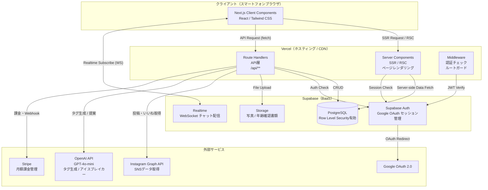
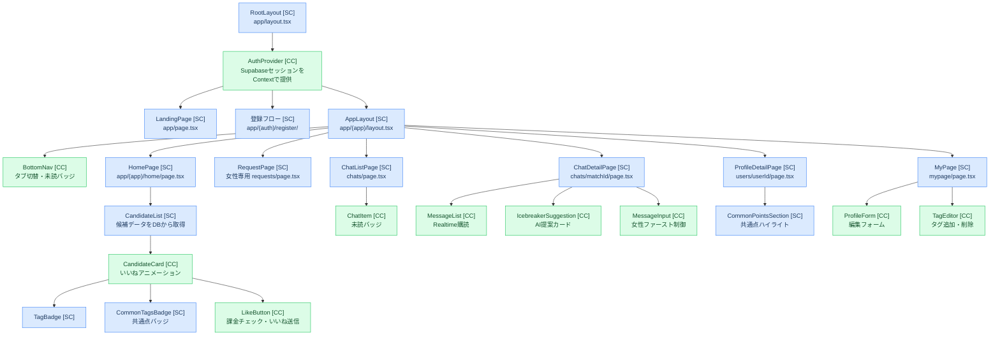
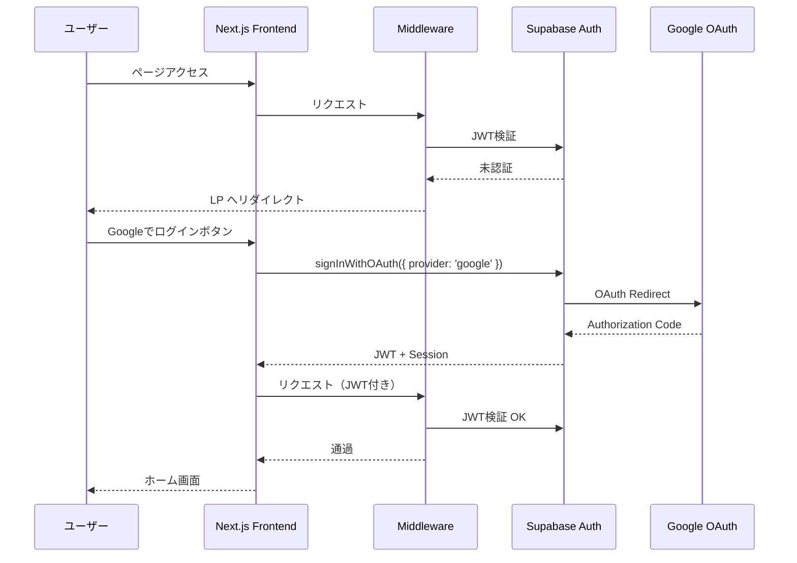

# システムアーキテクチャ設計書 — Truener

---

## 1. 技術スタック

| レイヤー | 技術 | バージョン | 選定理由 |
|----------|------|-----------|----------|
| フロントエンド | **Next.js (App Router)** | 14.x | SSR/RSCによる高速初期表示・SEO対応・Vercelとの最高の親和性 |
| 言語 | **TypeScript** | 5.x | 型安全性によるバグ早期検出・チーム開発・保守性向上 |
| スタイリング | **Tailwind CSS** | 3.x | ユーティリティファーストで高速実装。レスポンシブ対応が容易 |
| アイコン | **Lucide React** | latest | 丸みのある線画スタイルがTruenerのデザインコンセプトに合致 |
| バックエンド | **Next.js Route Handlers** | — | フロントと同一リポジトリで管理。SNSトークン・AI APIをサーバーサイドで安全に処理 |
| データベース | **Supabase (PostgreSQL)** | — | RLSによる行レベルセキュリティ・Realtime・Auth・Storageをオールインワンで提供 |
| 認証 | **Supabase Auth + Google OAuth 2.0** | — | Google連携が容易。セッション管理がSupabaseと完全統合 |
| リアルタイム | **Supabase Realtime** | — | チャットのリアルタイム配信をWebSocketで提供。追加インフラ不要 |
| ストレージ | **Supabase Storage** | — | 年齢確認書類・プロフィール写真をSupabase内で一元管理 |
| AI | **OpenAI API (GPT-4o-mini)** | — | 趣味タグ生成・アイスブレイカー提案に使用。コスト効率が高い |
| 決済 | **Stripe** | — | 月額サブスク・フリーミアム制御・Webhookによる課金状態管理 |
| ホスティング | **Vercel** | — | Next.jsとの最高の親和性。自動デプロイ・CDN・サーバーレス関数を標準提供 |
| SNS連携（MVP） | **Instagram Graph API** | — | 投稿・いいね情報の読み取り専用取得。X APIはPhase 2以降 |

---

## 2. アーキテクチャ概要

### 2.1 全体構成図（Mermaid）



### 2.2 各コンポーネントの役割

| コンポーネント | 役割 |
|---------------|------|
| **Vercel / Server Components** | ページの初期HTMLをサーバーサイドでレンダリング。DBから直接データを取得し、SEOと初期表示速度を最適化 |
| **Vercel / Route Handlers** | SNSトークン管理・OpenAI API呼び出し・Stripe処理など、クライアントに渡してはいけない処理を担う純粋なAPIエンドポイント |
| **Vercel / Middleware** | 全リクエストに対してSupabase AuthのJWTを検証。未認証ユーザーをLPへリダイレクト。年齢確認未完了ユーザーを審査待ち画面へ誘導 |
| **Supabase Auth** | Google OAuth 2.0のコールバック処理、JWTの発行・検証、セッションのリフレッシュを担当 |
| **Supabase PostgreSQL** | アプリケーションの全データを格納。RLSにより認証ユーザーが自分に許可されたデータのみアクセス可能 |
| **Supabase Realtime** | `messages` テーブルへのINSERTをチャット詳細画面にリアルタイム配信。チャット一覧の未読バッジ更新にも使用 |
| **Supabase Storage** | プロフィール写真（公開バケット）と年齢確認書類（非公開バケット・暗号化）を分離管理 |

---

## 3. コンポーネント設計

### 3.1 ディレクトリ構成

```
src/
├── app/
│   ├── layout.tsx                    # RootLayout (SC)
│   ├── page.tsx                      # ランディングページ (SC)
│   ├── (auth)/
│   │   ├── register/
│   │   │   ├── basic/page.tsx        # 登録①基本情報 (SC)
│   │   │   ├── age-verify/page.tsx   # 登録②年齢確認 (SC)
│   │   │   ├── sns/page.tsx          # 登録③SNS連携 (SC)
│   │   │   ├── tags/page.tsx         # 登録④タグ確認 (SC)
│   │   │   └── profile/page.tsx      # 登録⑤プロフィール作成 (SC)
│   │   └── payment/page.tsx          # 決済登録 (SC)
│   ├── (app)/
│   │   ├── layout.tsx                # AppLayout with BottomNav (SC)
│   │   ├── home/page.tsx             # ホーム/候補一覧 (SC)
│   │   ├── requests/page.tsx         # リクエスト一覧 女性専用 (SC)
│   │   ├── chats/
│   │   │   ├── page.tsx              # チャット一覧 (SC)
│   │   │   └── [matchId]/page.tsx    # チャット詳細 (SC)
│   │   ├── users/[userId]/page.tsx   # プロフィール詳細 (SC)
│   │   └── mypage/
│   │       ├── page.tsx              # マイページ (SC)
│   │       └── edit/page.tsx         # プロフィール編集 (SC)
│   └── api/
│       ├── tags/generate/route.ts    # タグ自動生成
│       ├── icebreaker/route.ts       # アイスブレイカー生成
│       ├── likes/route.ts            # いいね送信
│       ├── likes/[likeId]/route.ts   # いいね承認・スキップ
│       ├── age-verify/route.ts       # 年齢確認書類アップロード
│       └── webhooks/stripe/route.ts  # Stripe Webhook
├── components/
│   ├── layout/
│   │   └── BottomNav.tsx             # CC
│   ├── candidate/
│   │   ├── CandidateList.tsx         # SC
│   │   ├── CandidateCard.tsx         # CC
│   │   ├── TagBadge.tsx              # SC
│   │   └── CommonTagsBadge.tsx       # SC
│   ├── chat/
│   │   ├── ChatItem.tsx              # CC
│   │   ├── MessageList.tsx           # CC (Realtime)
│   │   ├── MessageInput.tsx          # CC
│   │   └── IcebreakerSuggestion.tsx  # CC
│   ├── profile/
│   │   ├── CommonPointsSection.tsx   # SC
│   │   ├── LikeButton.tsx            # CC
│   │   └── ProfileForm.tsx           # CC
│   └── tags/
│       └── TagEditor.tsx             # CC
├── lib/
│   ├── supabase/
│   │   ├── client.ts                 # クライアントサイド用
│   │   ├── server.ts                 # サーバーサイド用
│   │   └── middleware.ts             # Middleware用
│   ├── openai.ts                     # OpenAI クライアント
│   └── stripe.ts                     # Stripe クライアント
└── types/
    ├── database.ts                   # Supabase自動生成型
    └── index.ts                      # アプリ共通型
```

### 3.2 コンポーネント階層図（Mermaid）



**凡例:** 🔵 SC = Server Component（データフェッチ・初期レンダリング）/ 🟢 CC = Client Component（インタラクション・状態管理）

### 3.3 主要コンポーネント詳細

#### `CandidateCard` [Client Component]

```typescript
// types/index.ts
type CandidateUser = {
  id: string
  nickname: string
  age: number
  area: string
  photoUrl: string
  commonTagCount: number
  commonTags: { name: string; emoji: string }[]
}

// components/candidate/CandidateCard.tsx
type CandidateCardProps = {
  user: CandidateUser
  onLike: (userId: string) => Promise<{ success: boolean; requiresPayment: boolean }>
}
```
- **状態管理:** `useState<boolean>` でいいね済みフラグを管理。アニメーション（ハートが赤くなる）をローカル状態で制御
- **課金チェック:** `onLike` のレスポンスで `requiresPayment: true` の場合はStripe Checkoutへリダイレクト
- **理由:** ボタン操作・アニメーションがあるためClient Component

---

#### `MessageList` [Client Component]

```typescript
type Message = {
  id: string
  matchId: string
  senderId: string
  content: string
  isRead: boolean
  createdAt: string
}

type MessageListProps = {
  matchId: string
  initialMessages: Message[]
  currentUserId: string
}
```
- **状態管理:** `useState<Message[]>` でメッセージ一覧を管理。`useEffect` でSupabase Realtimeの `INSERT` イベントを購読し、新着メッセージをリストに追加
- **既読処理:** 画面表示時に未読メッセージを既読に更新するAPIを呼び出す
- **理由:** WebSocket接続（Realtime）が必要なためClient Component

---

#### `IcebreakerSuggestion` [Client Component]

```typescript
type IcebreakerSuggestion = {
  text: string
  relatedTag: string
  emoji: string
}

type IcebreakerSuggestionProps = {
  matchId: string
  commonTags: string[]
  isFirstMessage: boolean       // 女性ファーストメッセージ未送信かどうか
  onSelect: (text: string) => void
}
```
- **状態管理:** `useState<IcebreakerSuggestion[]>` で提案一覧を管理。`useTransition` でAI生成中のローディング状態を制御（UIをブロックしない）
- **表示条件:** `isFirstMessage === true`（女性側の最初のメッセージ未送信）の場合のみ表示
- **理由:** ユーザー操作・API非同期処理が必要なためClient Component

---

## 4. セキュリティアーキテクチャ

### 4.1 認証フロー



### 4.2 Row Level Security（RLS）方針

| テーブル | SELECT | INSERT | UPDATE | DELETE |
|----------|--------|--------|--------|--------|
| users | 自分 + マッチング相手 | 自分のみ | 自分のみ | 自分のみ |
| messages | マッチング当事者のみ | 送信者のみ | 送信者のみ | 不可 |
| likes | 自分が送受信したもの | 自分のみ | 自分のみ | 不可 |
| matches | 自分が含まれるもの | システムのみ | システムのみ | 不可 |
| age_verifications | 自分のみ | 自分のみ | システムのみ | 不可 |
