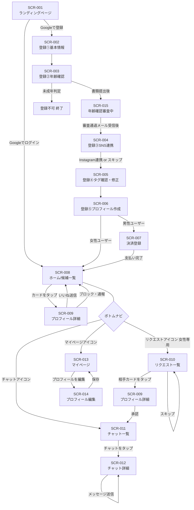

# UI/UXデザイン設計書 — Truener

---

## 1. デザインコンセプト

### 1.1 コンセプト

**「つながりの温かみ」**

婚活アプリの"重さ"を払拭し、SNSアプリのような軽快さと親しみやすさを持つデザイン。
「共通点が見つかる喜び」と「話しかけやすさ」を視覚的に体験できるUIを目指す。

**デザインキーワード:**
- 温かみ — 人と人のつながりを感じる暖色系デザイン
- 軽快さ — ストレスなくサクサク操作できる
- 親しみやすさ — 初めての人でも直感的にわかる
- 誠実さ — 婚活という真剣な文脈にふさわしい品格
- 発見の喜び — 「合う人がいた！」という体験を演出

### 1.2 カラーパレット

| 用途 | カラー名 | HEX | Tailwind クラス目安 |
|------|----------|-----|-------------------|
| メインカラー | コーラルピンク | `#FF6B6B` | `bg-[#FF6B6B]` / CTAボタン・いいねアイコン |
| サブカラー | サーモンオレンジ | `#FF8C69` | グラデーション・ホバー状態 |
| アクセント | ターコイズ | `#1ABC9C` | 共通タグハイライト・マッチング通知・バッジ |
| 背景 | オフホワイト | `#F8F8F8` | `bg-[#F8F8F8]` / ページ背景 |
| カード背景 | ホワイト | `#FFFFFF` | `bg-white` / カード・モーダル |
| テキスト（主） | ダークグレー | `#333333` | `text-[#333333]` / 本文・見出し |
| テキスト（補） | ミディアムグレー | `#888888` | `text-[#888888]` / サブテキスト・日時 |
| ボーダー | ライトグレー | `#E5E5E5` | `border-[#E5E5E5]` / 区切り線 |

### 1.3 タイポグラフィ

| 要素 | フォント | ウェイト | サイズ |
|------|----------|---------|--------|
| ページ見出し（H1） | Noto Sans JP | Bold（700） | 24px / 1.5rem |
| セクション見出し（H2） | Noto Sans JP | SemiBold（600） | 18px / 1.125rem |
| 本文 | Noto Sans JP | Regular（400） | 14px / 0.875rem |
| タグテキスト | Noto Sans JP | Medium（500） | 12px / 0.75rem |
| ボタンテキスト | Noto Sans JP | SemiBold（600） | 14px / 0.875rem |
| キャプション | Noto Sans JP | Regular（400） | 11px / 0.6875rem |

### 1.4 コンポーネント定義

**ボタン:**
```
Primary CTA: bg-[#FF6B6B] text-white rounded-full px-6 py-3 font-semibold shadow-sm
Secondary: border border-[#FF6B6B] text-[#FF6B6B] rounded-full px-6 py-3
Ghost: text-[#888888] rounded-full px-4 py-2
```

**タグチップ:**
```
通常タグ: bg-[#F8F8F8] text-[#555555] text-xs rounded-full px-3 py-1 border border-[#E5E5E5]
共通タグ: bg-[#1ABC9C]/10 text-[#1ABC9C] text-xs rounded-full px-3 py-1 border border-[#1ABC9C]/30
```

**カード:**
```
候補カード: bg-white rounded-2xl shadow-sm border border-[#E5E5E5] overflow-hidden
```

### 1.5 アイコン

- ライブラリ: `Lucide React`（統一使用）
- スタイル: 線画（stroke）、丸みのある形状
- サイズ: ナビ 24px / インライン 16px

### 1.6 アニメーション

| 場面 | アニメーション |
|------|---------------|
| いいねボタン押下 | ハートが `scale-110` に拡大 → 赤に変色（0.2秒） |
| マッチング成立 | 画面上から紙吹雪パーティクル + モーダルスライドイン |
| タグ選択 | チェックマークのフェードイン（0.15秒） |
| 画面遷移 | スライドイン（右から左、0.3秒） |
| ローディング | スケルトンアニメーション（pulse） |

---

## 2. 画面一覧

| 画面ID | 画面名 | パス | 対象ユーザー | 概要 |
|--------|--------|------|-------------|------|
| SCR-001 | ランディングページ | `/` | 未ログイン | サービス紹介・Googleログイン |
| SCR-002 | 登録①基本情報 | `/register/basic` | 新規 | 性別・生年月日・エリア |
| SCR-003 | 登録②年齢確認 | `/register/age-verify` | 新規 | 証明書アップロード |
| SCR-015 | 年齢確認審査中 | `/register/age-verify/pending` | 新規 | 審査待ち画面 |
| SCR-004 | 登録③SNS連携 | `/register/sns` | 新規 | Instagram連携案内 |
| SCR-005 | 登録④タグ確認 | `/register/tags` | 新規 | 生成タグの確認・修正 |
| SCR-006 | 登録⑤プロフィール | `/register/profile` | 新規 | 写真・ニックネーム・自己紹介 |
| SCR-007 | 決済登録 | `/payment` | 新規男性 | Stripe Checkout（女性はスキップ） |
| SCR-008 | ホーム（候補一覧） | `/home` | 全ユーザー | マッチング候補カード一覧 |
| SCR-009 | プロフィール詳細 | `/users/[userId]` | 全ユーザー | 相手詳細・共通点・いいね |
| SCR-010 | リクエスト一覧 | `/requests` | 女性のみ | いいねリクエストの管理 |
| SCR-011 | チャット一覧 | `/chats` | 全ユーザー | マッチング済みチャット一覧 |
| SCR-012 | チャット詳細 | `/chats/[matchId]` | 全ユーザー | 1対1チャット・アイスブレイカー |
| SCR-013 | マイページ | `/mypage` | 全ユーザー | プロフィール確認・設定 |
| SCR-014 | プロフィール編集 | `/mypage/edit` | 全ユーザー | 写真・自己紹介・タグ編集 |

---

## 3. 画面遷移図（Mermaid）



---

## 4. 主要画面ワイヤーフレーム

### SCR-008: ホーム（候補一覧）

```
┌─────────────────────────────────┐
│  [ロゴ: Truener]        🔔 0   │  ← ヘッダー（通知バッジ付き）
├─────────────────────────────────┤
│  ┌─────────────────────────┐   │
│  │  [プロフィール写真 大]  │   │  ← アスペクト比 3:4
│  ├─────────────────────────┤   │
│  │  さくら  28歳  東京     │   │
│  │  ✨ あなたとの共通点 5個│   │  ← ターコイズ背景バッジ
│  │  🎵音楽  🎤ライブ ☕カフェ│  │  ← 共通タグチップ（最大3個）
│  │  ──────────────────────│   │
│  │         ♡ いいねを送る  │   │  ← コーラルピンク フルWidth ボタン
│  └─────────────────────────┘   │
│                                 │
│  ┌─────────────────────────┐   │
│  │  [写真]                 │   │
│  │  みほ  26歳  神奈川     │   │
│  │  ✨ 共通点 3個          │   │
│  │  🏃登山  🎬映画         │   │
│  │         ♡ いいねを送る  │   │
│  └─────────────────────────┘   │
│  ↕ スクロールで続く             │
├─────────────────────────────────┤
│  🏠ホーム  💌リクエスト  💬チャット  👤マイ│  ← ボトムナビ
└─────────────────────────────────┘

【インタラクション】
- カードをタップ → SCR-009へ遷移
- 「♡ いいねを送る」をタップ → ハートアニメーション → 課金チェック
- 無限スクロール（ページネーション）
```

---

### SCR-009: プロフィール詳細

```
┌─────────────────────────────────┐
│  ←  プロフィール        ⋯      │  ← ヘッダー（戻る + メニュー）
├─────────────────────────────────┤
│  [写真1] [写真2] [写真3]        │  ← 横スクロール写真（○インジケーター付き）
├─────────────────────────────────┤
│  健太さん  31歳  神奈川県       │
│  最終ログイン: 1時間前          │  ← ミディアムグレー・小さめ
├─────────────────────────────────┤
│  ┌────────────────────────────┐ │
│  │ ✨ あなたとの共通点 4個    │ │  ← ターコイズ背景のセクション
│  │ ┌──────┐ ┌──────┐         │ │
│  │ │🏃登山 │ │🎬映画 │        │ │  ← 共通タグチップ（ターコイズ）
│  │ └──────┘ └──────┘         │ │
│  │ ┌──────┐ ┌──────┐         │ │
│  │ │🎵音楽 │ │☕カフェ│       │ │
│  │ └──────┘ └──────┘         │ │
│  └────────────────────────────┘ │
├─────────────────────────────────┤
│  自己紹介                       │
│  「休日はよく登山に行きます。   │
│   最近は丹沢にハマってます。    │
│   映画も好きでミニシアター系    │
│   が特に好きです」              │
├─────────────────────────────────┤
│  すべてのタグ                   │
│  🏃登山  🎬映画  🎸音楽         │
│  ☕カフェ  🍺クラフトビール     │
│  📚読書                         │
├─────────────────────────────────┤
│  ┌─────────────────────────┐   │
│  │    ♡  いいねを送る      │   │  ← コーラルピンク CTA
│  └─────────────────────────┘   │
└─────────────────────────────────┘

【インタラクション】
- 写真を左右スワイプで切替
- タグをタップ → そのタグを持つ他のユーザーを検索（Phase 2）
- 「⋯」メニュー → ブロック / 通報
- いいね送信後はボタンが「送信済み」に変化してtapped状態
```

---

### SCR-012: チャット詳細

```
┌─────────────────────────────────┐
│  ←  さくらさん          ⋯      │  ← ヘッダー
│     [小写真] 接続中 🟢         │  ← オンラインインジケーター
├─────────────────────────────────┤
│  ┌──────────────────────────┐  │
│  │ ✨共通点: 音楽好き・ライブ好き・カフェ巡り│  ← 共通点バー（折りたたみ可）
│  └──────────────────────────┘  │
├─────────────────────────────────┤
│  ┌────────────────────────┐    │  ← アイスブレイカーカード
│  │ 💡 最初のひとことを提案  │    │    （is_first_message_sent = false の場合のみ）
│  │ ┌──────────────────────┐│   │
│  │ │🎤 最近ライブ行きまし  ││   │  ← 提案①（タップで入力欄にセット）
│  │ │   たか？どのアーティ  ││   │
│  │ │   スト好きですか？    ││   │
│  │ └──────────────────────┘│   │
│  │ ┌──────────────────────┐│   │
│  │ │☕ お気に入りのカフェ  ││   │  ← 提案②
│  │ │   はありますか？      ││   │
│  │ └──────────────────────┘│   │
│  │            [自分で書く]  │    │
│  └────────────────────────┘    │
│                                 │
│  ┌───────────────────┐         │  ← 相手のメッセージ（左）
│  │ こんにちは！       │         │
│  └───────────────────┘         │
│  06/18 14:32                   │
│                                 │
│               ┌──────────────┐ │  ← 自分のメッセージ（右）
│               │ 最近ライブ行き│ │
│               │ ましたか？   │ │
│               └──────────────┘ │
│                  ✓既読 14:33   │
│                                 │
├─────────────────────────────────┤
│  ┌───────────────────────┐ [↑] │  ← 入力欄 + 送信ボタン
│  │ メッセージを入力...   │     │
│  └───────────────────────┘     │
└─────────────────────────────────┘

【インタラクション】
- 提案カードをタップ → 入力欄にテキストをセット（編集可能）
- 送信ボタン → メッセージ送信 + Realtimeで相手に配信
- 女性ファーストメッセージ未送信の場合のみアイスブレイカーカードを表示
- 男性側は女性からのメッセージが来るまで入力欄をdisabledにして説明テキストを表示
```

---

### SCR-010: リクエスト一覧（女性専用）

```
┌─────────────────────────────────┐
│  リクエスト（8件）              │  ← ヘッダー（件数表示）
├─────────────────────────────────┤
│  ┌─────────────────────────┐   │
│  │ [写真] 健太  31歳  神奈川│   │
│  │        ✨ 共通点 4個     │   │
│  │        🏃登山  🎬映画    │   │
│  │   [スキップ]  [プロフィールを見る]│  ← 2ボタン
│  └─────────────────────────┘   │
│  ┌─────────────────────────┐   │
│  │ [写真] たくみ 28歳 東京  │   │
│  │        ✨ 共通点 2個     │   │
│  │        ☕カフェ  🎵音楽  │   │
│  │   [スキップ]  [プロフィールを見る]│
│  └─────────────────────────┘   │
│  ↕ スクロール                   │
├─────────────────────────────────┤
│  🏠ホーム  💌リクエスト  💬チャット  👤マイ│
└─────────────────────────────────┘

【インタラクション】
- 「プロフィールを見る」→ SCR-009（プロフィール詳細）へ。承認ボタンをそこで押す
- 「スキップ」→ 確認なしで即時スキップ（相手に通知なし）
- 右スワイプ → 承認 / 左スワイプ → スキップ（ジェスチャー操作）
```

---

## 5. レスポンシブ設計方針

- **ベースデザイン:** スマートフォン（375px〜）を優先設計
- **ブレークポイント:**

| ブレークポイント | 幅 | 対応 |
|----------------|-----|------|
| デフォルト | 〜767px | スマートフォン（メイン） |
| md | 768px〜 | タブレット（2カラム候補一覧など） |
| lg | 1024px〜 | PC（サイドバーレイアウト） |

- **ボトムナビ:** スマートフォンのみ表示。PCではサイドナビに切替
- **チャット:** PCでは左サイドにチャット一覧 + 右メインにチャット詳細の2ペインレイアウト

---

## 6. アクセシビリティ方針

- カラーコントラスト比：WCAG 2.1 AA基準（4.5:1以上）を遵守
- ボタン・インタラクティブ要素の最小タッチターゲット：44×44px
- `aria-label` の適切な付与（いいねボタン、通知バッジ等）
- フォームの `label` 要素との適切な紐付け
- キーボード操作への対応（フォーカスの視覚的表示）
