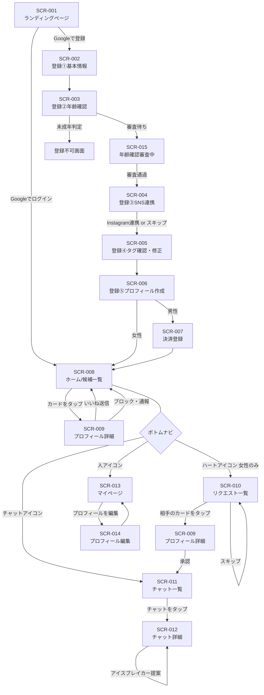
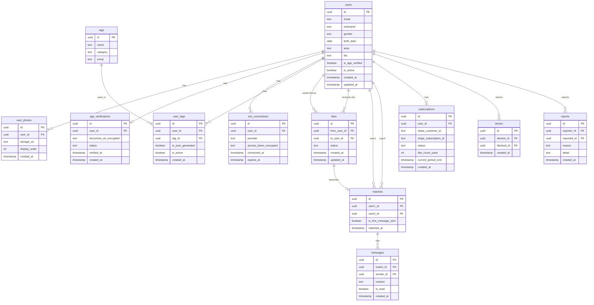
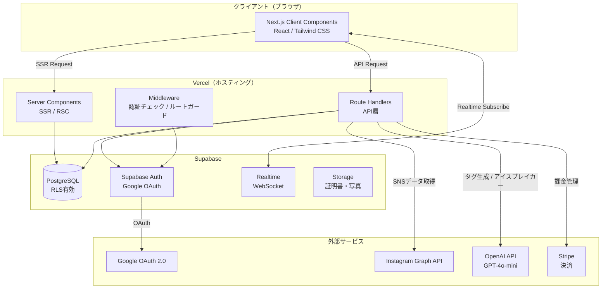
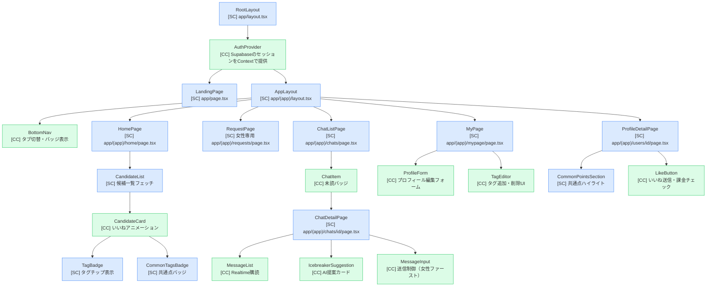

# 要件定義書 — Truener

---

## 1. プロジェクト概要

### 1.1 プロジェクト名

**「Truener — SNS趣味共鳴マッチングアプリ 開発プロジェクト」**

### 1.2 背景・目的

**背景:**
国内マッチングアプリ市場は成熟期に入り、「ただマッチングできる」だけでは差別化が困難になっている。既存サービスの主な課題は、自己申告プロフィールへの依存によって本当の相性が伝わらないこと、そしてマッチング後に会話のきっかけがなく自然消滅するケースが多発していることである。特に真剣に婚活しているユーザーにとって、この「消耗感」がサービス離脱の主因となっている。

**目的:**
- SNS（Instagram）の投稿データをAIで解析し趣味タグを自動生成することで、自己申告に依存しない「本音の相性」マッチングを実現する
- 共通点の可視化とAIアイスブレイカー提案により、マッチング後チャット継続率を50%以上に引き上げる
- 女性完全無料・女性ファーストメッセージ制・いいねリクエスト承認制により女性ユーザーを獲得し、男性の月額課金（6,000円）で持続可能な収益モデルを確立する

### 1.3 システムのビジョン / スコープ

**ビジョン:**
「話のきっかけが最初からある出会い」を提供する婚活プラットフォームとして、SNSデータ活用の先駆者ポジションを確立する。将来的にはX連携・クレカ認証・AI相性レポート等を追加し、婚活に特化した信頼性の高いマッチングインフラへ発展させる。

**スコープ（MVP）:**
- 対象：Webアプリ（スマートフォンブラウザ最適化 / レスポンシブ）
- 含まれる範囲：Google認証・年齢確認・Instagram連携・AIタグ生成・マッチング・チャット・Stripe課金
- 含まれない範囲：X API連携（Phase 2）・ネイティブアプリ（将来）・クレカ認証（Phase 2）・PWA（将来）

---

## 2. ビジネス要件

### 2.1 ビジネスモデル情報

**リーンキャンバス要約:**

| 項目 | 内容 |
|------|------|
| 解決する課題 | マッチング後の会話不成立・自然消滅。自己申告プロフィールの不信感 |
| 価値提案 | SNS由来の趣味タグと共通点可視化で「話しかけやすい出会い」を提供 |
| ターゲットユーザー | 25〜35歳・婚活中・マッチングアプリ経験者 |
| 収益構造 | 男性月額6,000円（フリーミアム）・女性完全無料 |
| コスト構造 | Instagram API・OpenAI API・Supabase・Vercel・Stripe・KYCサービス |
| 差別化 | SNS自動タグ・共通点ハイライト・AIアイスブレイカー・女性保護UX |
| 参入障壁 | データネットワーク効果・スイッチングコスト |

**7Powers視点での優位性:**
- **データネットワーク効果:** SNS連携データが蓄積されるほどタグ精度が向上し、後発の追随が困難になる
- **スイッチングコスト:** タグ・マッチング履歴の蓄積により乗り換えコストが発生

### 2.2 成果指標（KPI/KGI）

| 指標 | 目標値 | 計測時期 |
|------|--------|----------|
| マッチング後チャット継続率（3往復以上） | 50%以上 | クローズドβ終了時（MVPリリース後2ヶ月） |
| Instagram SNS連携率 | 60%以上 | クローズドβ終了時 |
| 男性月次継続率（サブスク） | 40%以上 | MVP後3ヶ月 |
| 月間アクティブユーザー（MAU） | 500人以上 | Phase 2開始時（MVP後4ヶ月） |

### 2.3 ビジネス上の制約

- **法的要件：** 出会い系サイト規制法に基づき、公的証明書による年齢確認（18歳以上）をMVP時点で必須実装
- **API制約：** Instagram Graph APIの利用制限（レート制限・利用規約）への準拠が必要。X APIはコスト観点からPhase 2以降
- **プライバシー：** 個人情報保護法に基づき、SNS取得データ・年齢確認書類の取り扱いポリシーを策定・公開
- **開発体制：** (仮定) フルスタックエンジニア1〜2名体制でMVPを3ヶ月以内にリリース

---

## 3. ユーザー要件

### 3.1 ユーザープロファイル / ペルソナ

**ペルソナA（女性ユーザー）:**
- 名前（仮）：田中 さくら、28歳、IT企業マーケター、東京都内在住
- 利用シーン：就寝前・移動中にスマートフォンで閲覧
- 課題：Pairsを1年使ったが「会話が3往復で終わる」消耗感。「また同じ自己紹介」に疲れた
- 求めること：最初から話が合いそうとわかる相手。メッセージのきっかけが自然にある設計
- 懸念点：SNSを「見られる」ことへのプライバシー不安

**ペルソナB（男性ユーザー）:**
- 名前（仮）：鈴木 健太、31歳、Web系エンジニア、神奈川県在住
- 利用シーン：リモートワークの昼休み・移動中
- 課題：「最初のメッセージが思いつかない」。プロフィール作成が苦手で自分をうまく表現できない
- 求めること：共通点がある相手にだけ話しかけたい。AIが会話のきっかけを提案してくれると嬉しい

### 3.2 ユーザーストーリー

1. **さくら（女性）として、** 届いたいいねリクエストを自分のペースで確認・承認したい。**なぜなら**、興味のない相手から一方的にメッセージが来る圧迫感をなくしたいからだ。

2. **健太（男性）として、** マッチングした相手のプロフィールに「共通点〇個」と共通タグが表示された状態でチャットを始めたい。**なぜなら**、何を話せばいいかわからなくて最初のメッセージを送れないことが多いからだ。

3. **さくらとして、** Instagramと連携するだけで自動的に趣味タグが生成されてほしい。**なぜなら**、プロフィール文を一から書くのが面倒で、手動入力では本当の自分の趣味が伝わりにくいからだ。

4. **健太として、** 月額6,000円の課金前に20いいねを無料で試せるようにしてほしい。**なぜなら**、サービスの価値を体験してから課金するかどうか判断したいからだ。

5. **さくらとして、** チャット開始時にAIが「〇〇さんも最近ライブ行ったみたいですね」という会話例を提案してくれたい。**なぜなら**、共通点があるとわかっていても最初のメッセージの文章を考えるのに時間がかかるからだ。

### 3.3 MVP（Minimum Viable Product）の定義

**MVPで実装する範囲:**

| 機能 | 理由 |
|------|------|
| Google認証ログイン | 最小ステップでの登録体験 |
| 年齢確認（公的証明書） | 法的義務。MVP必須 |
| Instagramタグ自動生成 | コアバリューの根幹 |
| タグ手動修正・追加 | SNS未連携ユーザーへのフォールバック |
| マッチング候補一覧（共通タグ表示） | コアバリューの体験 |
| いいねリクエスト承認制 | 女性獲得の必須施策 |
| 女性ファーストメッセージ制 | 同上 |
| 1対1チャット + AIアイスブレイカー | 会話継続率向上の核心 |
| ブロック・通報 | 最低限の安全性 |
| Stripe課金（男性6,000円・女性無料） | 収益確保 |

**MVPのゴール:**
クローズドβ（招待制50〜100名）で「SNSタグマッチングによって会話継続率が向上する」という仮説を検証し、次フェーズへの投資判断を行う。

---

## 4. 機能要件

### 4.1 機能一覧 / MoSCoW分類

| 機能ID | 機能名 | 要約 | Must/Should/Could/Won't | MVP対象 |
|--------|--------|------|------------------------|---------|
| F-001 | Google認証ログイン | Googleアカウントによるサインアップ・ログイン | Must | Yes |
| F-002 | 年齢確認 | 公的証明書の画像アップロードによる18歳以上の確認 | Must | Yes |
| F-003 | 基本プロフィール登録 | 性別・生年月日・エリア・ニックネーム・写真・自己紹介 | Must | Yes |
| F-004 | Instagram連携 | Instagram Graph APIによるデータ取得（読み取り専用） | Must | Yes |
| F-005 | AIタグ自動生成 | SNSデータをLLMで解析し趣味タグを自動生成 | Must | Yes |
| F-006 | タグ手動修正・追加 | 生成タグのユーザー確認・削除・追加 | Must | Yes |
| F-007 | マッチング候補一覧 | 共通タグ数・相性スコアでソートした候補リスト | Must | Yes |
| F-008 | 共通点ハイライト表示 | 詳細プロフィールで共通タグをカラー強調表示 | Must | Yes |
| F-009 | いいね機能 | 男性から女性へのいいね送信（男性は20回まで無料） | Must | Yes |
| F-010 | いいねリクエスト承認制 | 女性が受け取ったいいねを承認・スキップする管理画面 | Must | Yes |
| F-011 | マッチング成立通知 | 承認時に双方へ通知 | Must | Yes |
| F-012 | 女性ファーストメッセージ制 | マッチング後は女性のみ最初のメッセージを送れる | Must | Yes |
| F-013 | 1対1チャット | Supabase Realtimeによるリアルタイムテキストチャット | Must | Yes |
| F-014 | AIアイスブレイカー提案 | 共通タグをもとにAIが最初のメッセージ候補を2〜3個提案 | Must | Yes |
| F-015 | 男女別課金制御 | 女性完全無料・男性フリーミアム（Stripe） | Must | Yes |
| F-016 | ブロック機能 | 任意ユーザーのブロック | Must | Yes |
| F-017 | 通報機能 | 不審ユーザーへの通報（理由選択付き） | Must | Yes |
| F-018 | プロフィール編集 | 登録後のプロフィール変更 | Should | Yes |
| F-019 | チャット一覧 | マッチング済み相手の一覧（最終メッセージ・未読バッジ） | Should | Yes |
| F-020 | タグフィルター検索 | 年齢・エリア・タグで候補を絞り込む | Should | No（Phase 2） |
| F-021 | X（Twitter）連携 | X APIによるデータ取得 | Should | No（Phase 2） |
| F-022 | チャット内画像送信 | テキスト以外の画像共有 | Could | No（Phase 2） |
| F-023 | クレカ連携認証 | 身元確認のための追加認証 | Could | No（Phase 2） |
| F-024 | AI詳細相性レポート | 有料の詳細相性分析 | Could | No（Phase 3） |
| F-025 | スワイプUI | Tinder風カードスワイプ | Won't | No |

### 4.2 機能詳細仕様

#### 4.2.1 `F-005: AIタグ自動生成`

- **概要:** Instagramから取得したデータをOpenAI GPT-4o-miniで解析し、ユーザーの趣味・嗜好タグを10〜20個自動生成する
- **ユースケース:** 「新規ユーザーがInstagram連携後、自分の趣味タグを確認するとき」
- **前提条件:** Instagram OAuth連携が完了し、アクセストークンが取得済みであること
- **正常系フロー:**
  1. ユーザーがInstagram連携ボタンをタップ
  2. Instagram OAuth画面でアクセスを許可
  3. サーバーサイドでInstagram Graph APIを呼び出し、投稿・いいね情報を取得
  4. 取得データをOpenAI APIに送信し、タグ生成プロンプトを実行
  5. 生成されたタグ（10〜20個）をDBに保存
  6. タグ確認画面にリダイレクト。「〇個のタグを生成しました！」と表示
  7. ユーザーがタグを確認・削除・追加して「完了」
- **例外系フロー:**
  - Instagram APIがエラーを返した場合 → 「連携に失敗しました。もう一度試すか、手動でタグを追加してください」と表示
  - タグ生成が30秒以内に完了しない場合 → タイムアウトエラー表示 + 手動入力への誘導
  - OpenAI APIエラー → 手動タグ入力画面へフォールバック
- **UI要件:**
  - 生成中はローディングアニメーション（スピナー + 「AIが分析中...」テキスト）を表示
  - タグはカラーチップ形式で表示。×ボタンで削除、＋ボタンで追加
  - タグは最大30個まで保持可能
- **非機能面注意:**
  - SNSアクセストークンはサーバーサイドのみで処理。クライアントに渡さない
  - OpenAI APIコールはRoute Handlerで実行（クライアントサイドから直接呼ばない）
  - Instagram取得データの一時保存期間は処理完了後24時間以内に削除

---

#### 4.2.2 `F-014: AIアイスブレイカー提案`

- **概要:** マッチング後のチャット開始時、共通タグをもとにAIが最初のメッセージ候補を2〜3パターン提案する
- **ユースケース:** 「女性ユーザーがマッチング後、最初のメッセージを送ろうとするとき」
- **前提条件:** マッチングが成立していること。双方のタグが1つ以上登録されていること
- **正常系フロー:**
  1. 女性ユーザーがチャット詳細画面を開く
  2. 画面上部に「共通点: 音楽好き・ライブ好き・カフェ巡り」を表示
  3. 「会話のきっかけを提案する」ボタンを表示（目立つ位置に配置）
  4. ボタンタップ → OpenAI APIでアイスブレイカーを生成
  5. 2〜3個のメッセージ候補をカード形式で表示
  6. 候補をタップ → メッセージ入力欄にセット。編集してから送信可能
  7. 「自分で書く」ボタンも常に表示（提案不要な場合のバイパス）
- **例外系フロー:**
  - 共通タグが0個の場合 → 汎用的なアイスブレイカー（「どんな休日を過ごしていますか？」等）を提案
  - OpenAI APIエラー → 提案なしでチャット画面を表示。エラーはユーザーに非表示
- **UI要件:**
  - 提案は吹き出し風カードで表示（フレンドリーなデザイン）
  - 各提案にはタグアイコンと関連タグ名を添える（例：🎵 音楽好き）
  - 生成中はスケルトンローディングで提案カードのプレースホルダーを表示
- **非機能面注意:**
  - 生成時間は通常2〜5秒を想定。5秒超でタイムアウト、フォールバック表示
  - 不適切なコンテンツ生成防止のためシステムプロンプトにガードレールを設定

---

#### 4.2.3 `F-010: いいねリクエスト承認制`

- **概要:** 男性からのいいねを「リクエスト」として女性側で管理し、女性が承認した相手とのみマッチングが成立する
- **ユースケース:** 「女性ユーザーが届いたいいねリクエストを確認・選択するとき」
- **前提条件:** 男性ユーザーが女性ユーザーにいいねを送信済みであること
- **正常系フロー（承認）:**
  1. 女性がボトムナビの「リクエスト」タブを開く
  2. リクエスト一覧を表示（相手の写真・名前・共通タグ数）
  3. 相手のカードをタップ → 詳細プロフィール表示（共通点ハイライトあり）
  4. 「承認する」ボタンをタップ
  5. マッチング成立。双方に通知を送信
  6. チャット一覧にマッチングが追加される
- **正常系フロー（スキップ）:**
  1. 上記3の状態で「スキップ」ボタンをタップ
  2. リクエストが非表示になる（男性には通知なし）
- **例外系フロー:**
  - 承認後に相手がアカウント削除した場合 → チャット一覧から自動で非表示
- **UI要件:**
  - リクエスト一覧はカード形式。スワイプ操作でも承認/スキップ可能（右:承認、左:スキップ）
  - リクエスト数はボトムナビに未読バッジで表示
  - 承認時はマッチングアニメーション（紙吹雪エフェクト）を表示

---

## 5. UI/UX設計

### 5.1 デザインコンセプト

**コンセプト:** 「つながりの温かみ」
婚活アプリの重さを払拭し、SNSアプリのような軽快さと親しみやすさを持つデザイン。共通点が見つかる「喜び」と「発見」を視覚的に演出する。

**カラーパレット:**

| 用途 | カラー名 | HEX | 使用箇所 |
|------|----------|-----|----------|
| メインカラー | コーラルピンク | `#FF6B6B` | CTAボタン・いいねアイコン・アクセント |
| サブカラー | サーモンオレンジ | `#FF8C69` | グラデーション・カード背景 |
| アクセント | ターコイズ | `#1ABC9C` | 共通タグハイライト・マッチング通知 |
| 背景 | オフホワイト | `#F8F8F8` | ページ背景 |
| カード背景 | ホワイト | `#FFFFFF` | カード・モーダル |
| テキスト（主） | ダークグレー | `#333333` | 本文・見出し |
| テキスト（補） | ミディアムグレー | `#888888` | サブテキスト・日時 |
| ボーダー | ライトグレー | `#E5E5E5` | 区切り線・ボーダー |

**タイポグラフィ:**
- 見出し：`Noto Sans JP`（Bold / 700）、丸みのあるサンセリフ
- 本文：`Noto Sans JP`（Regular / 400）
- タグテキスト：`Noto Sans JP`（Medium / 500）、font-size: 12px

**アイコン：** `Lucide React`（線画・丸みあり）を統一使用

### 5.2 画面一覧

| 画面ID | 画面名 | 対象ユーザー | 説明 |
|--------|--------|-------------|------|
| SCR-001 | ランディングページ | 未ログイン | サービス紹介・Googleログインボタン |
| SCR-002 | 登録①基本情報 | 新規ユーザー | 性別・生年月日・居住エリア入力 |
| SCR-003 | 登録②年齢確認 | 新規ユーザー | 公的証明書アップロード・審査待ち |
| SCR-004 | 登録③SNS連携 | 新規ユーザー | Instagram連携の案内・連携ボタン |
| SCR-005 | 登録④タグ確認・修正 | 新規ユーザー | 生成タグ一覧・削除・追加 |
| SCR-006 | 登録⑤プロフィール作成 | 新規ユーザー | 写真・ニックネーム・自己紹介文 |
| SCR-007 | 決済登録 | 新規男性ユーザー | Stripe決済情報入力（女性はスキップ） |
| SCR-008 | ホーム（候補一覧） | ログイン済み | マッチング候補カード一覧 |
| SCR-009 | プロフィール詳細 | ログイン済み | 相手の詳細・共通点ハイライト |
| SCR-010 | リクエスト一覧 | 女性ユーザー | いいねリクエストの承認・スキップ |
| SCR-011 | チャット一覧 | ログイン済み | マッチング済みチャットの一覧 |
| SCR-012 | チャット詳細 | ログイン済み | 1対1テキストチャット・アイスブレイカー |
| SCR-013 | マイページ | ログイン済み | プロフィール確認・設定 |
| SCR-014 | プロフィール編集 | ログイン済み | 写真・自己紹介・タグの編集 |
| SCR-015 | 年齢確認審査中 | 新規ユーザー | 審査完了を待つ待機画面 |

### 5.3 画面遷移図（Mermaid）



### 5.4 ワイヤーフレーム（テキストベース）

#### SCR-008: ホーム（候補一覧）

```
┌─────────────────────────────┐
│  Truener          🔔 通知   │ ← ヘッダー（ロゴ + 通知アイコン）
├─────────────────────────────┤
│  ┌───────────────────────┐  │
│  │  [写真]               │  │
│  │  さくら・28歳・東京    │  │
│  │  ✨ 共通点 5個        │  │ ← ターコイズのバッジ
│  │  🎵音楽 ☕カフェ 🎬映画│  │ ← 共通タグのチップ（最大3個表示）
│  │              ♡ いいね  │  │ ← コーラルピンクのボタン
│  └───────────────────────┘  │
│  ┌───────────────────────┐  │
│  │  [写真]               │  │
│  │  みほ・26歳・神奈川    │  │
│  │  ✨ 共通点 3個        │  │
│  │  🏃登山 🎬映画        │  │
│  │              ♡ いいね  │  │
│  └───────────────────────┘  │
│  （スクロールで続く）        │
├─────────────────────────────┤
│  🏠ホーム  💬リクエスト  👤マイページ│ ← ボトムナビ
└─────────────────────────────┘
```

#### SCR-012: チャット詳細

```
┌─────────────────────────────┐
│  ← さくらさんとのチャット   │ ← ヘッダー（戻るボタン + 相手名）
│  ✨ 共通点: 音楽・ライブ・カフェ│ ← 上部に共通点バー（ターコイズ）
├─────────────────────────────┤
│                             │
│  ┌─────────────────────┐   │
│  │ 💡 最初のひとことを  │   │ ← AIアイスブレイカー提案カード
│  │    AIが提案します    │   │
│  │  ┌─────────────────┐│   │
│  │  │🎵 最近ライブ    ││   │ ← 提案①
│  │  │行きましたか？   ││   │
│  │  └─────────────────┘│   │
│  │  ┌─────────────────┐│   │
│  │  │☕ お気に入りの  ││   │ ← 提案②
│  │  │カフェありますか?││   │
│  │  └─────────────────┘│   │
│  └─────────────────────┘   │
│   （メッセージエリア）       │
│                             │
│                    [自分で書く]│
├─────────────────────────────┤
│  ┌──────────────────┐ [送信]│ ← メッセージ入力欄
│  │                  │      │
│  └──────────────────┘      │
└─────────────────────────────┘
```

#### SCR-009: プロフィール詳細

```
┌─────────────────────────────┐
│  ←           ⋯ ブロック通報 │ ← ヘッダー
├─────────────────────────────┤
│  [メイン写真 - 大きく表示]  │
│  ○ ○ ○  （写真インジケーター）│
├─────────────────────────────┤
│  健太さん・31歳・神奈川     │
│  ✨ あなたとの共通点 4個   │ ← ターコイズのハイライトセクション
│  ┌──────┐ ┌──────┐         │
│  │🏃登山 │ │🎬映画 │        │ ← 共通タグ（ターコイズ背景）
│  └──────┘ └──────┘         │
├─────────────────────────────┤
│  自己紹介                   │
│  「休日はよく登山に行きます。│
│   最近は丹沢にハマってます」 │
├─────────────────────────────┤
│  すべてのタグ               │
│  🏃登山 🎬映画 🍺クラフトビール│
│  🎸音楽 📚読書              │
├─────────────────────────────┤
│  ┌───────────────────────┐  │
│  │     ♡  いいねを送る   │  │ ← コーラルピンクのCTAボタン
│  └───────────────────────┘  │
└─────────────────────────────┘
```

---

## 6. 非機能要件

### 6.1 パフォーマンス要件

| 項目 | 目標値 | 備考 |
|------|--------|------|
| 主要画面レスポンスタイム | 2秒以内 | Next.js Server ComponentsのSSR活用 |
| SNS連携・タグ生成 | 30秒以内 | バックグラウンド非同期処理 |
| チャットメッセージ配信 | 1秒以内 | Supabase Realtime |
| 同時接続ユーザー数 | 〜1,000人（MVP期） | Vercelサーバーレス + Supabase接続プール |

### 6.2 セキュリティ要件

- **認証・認可:** Google OAuth 2.0 + Supabase Auth。JWTトークンによるセッション管理。ミドルウェアによるルートレベルの認証チェック
- **年齢確認書類:** Supabase Storageに暗号化保存。確認完了後は法的保持期間を考慮した上で削除または最小保持
- **SNSトークン:** サーバーサイドのみで処理・保存（Supabase DBに暗号化）。クライアントには渡さない
- **チャットデータ:** Supabase RLS（Row Level Security）によりマッチング当事者のみアクセス可能
- **通信:** HTTPS必須。HSTSヘッダー設定
- **CSRF/XSS:** Next.jsのデフォルト保護に加え、入力値サニタイズを実施
- **個人情報保護法:** 取得データの利用目的・保存期間・第三者提供の有無をプライバシーポリシーに明記

### 6.3 可用性・信頼性

- **稼働率目標:** 99.9%以上（Vercel・Supabaseの標準SLA準拠）
- **バックアップ:** Supabaseの自動日次バックアップ（Point-in-time Recovery対応）
- **障害時対応:** SNS API障害時は手動タグ入力へフォールバック。OpenAI APIエラー時はアイスブレイカー非表示で継続利用可能

### 6.4 ユーザビリティ / UI・UX

- **アクセシビリティ:** WCAG 2.1 Level AA準拠を目指す（カラーコントラスト比・フォントサイズ）
- **多言語対応:** MVP時点は日本語のみ
- **操作導線:** ボトムナビゲーション3タブ構成でメイン機能へ最大2タップでアクセス可能

### 6.5 スケーラビリティ

- Vercelのサーバーレス関数によるオートスケール
- Supabase接続プール（pgBouncer）によるDB接続効率化
- OpenAI APIコールはバックグラウンドJob化し、リアルタイム処理と分離

---

## 7. データベース設計

### 7.1 ER図（Mermaid）



### 7.2 主要テーブル定義

#### `users` テーブル

| カラム名 | データ型 | 制約 | 説明 |
|----------|----------|------|------|
| id | uuid | PK, DEFAULT gen_random_uuid() | ユーザーID |
| email | text | NOT NULL, UNIQUE | Googleアカウントのメールアドレス |
| nickname | text | NOT NULL | 表示名 |
| gender | text | NOT NULL, CHECK IN ('male','female') | 性別 |
| birth_date | date | NOT NULL | 生年月日 |
| area | text | NOT NULL | 居住エリア |
| bio | text | | 自己紹介文（任意） |
| is_age_verified | boolean | NOT NULL, DEFAULT false | 年齢確認完了フラグ |
| is_active | boolean | NOT NULL, DEFAULT true | アカウント有効フラグ |
| created_at | timestamp | NOT NULL, DEFAULT now() | 作成日時 |
| updated_at | timestamp | NOT NULL, DEFAULT now() | 更新日時 |

#### `likes` テーブル

| カラム名 | データ型 | 制約 | 説明 |
|----------|----------|------|------|
| id | uuid | PK | いいねID |
| from_user_id | uuid | FK → users.id | いいね送信者 |
| to_user_id | uuid | FK → users.id | いいね受信者 |
| status | text | NOT NULL, CHECK IN ('pending','approved','skipped') | pending:承認待ち / approved:承認済 / skipped:スキップ |
| created_at | timestamp | NOT NULL, DEFAULT now() | 送信日時 |
| updated_at | timestamp | NOT NULL, DEFAULT now() | 更新日時 |

#### `messages` テーブル

| カラム名 | データ型 | 制約 | 説明 |
|----------|----------|------|------|
| id | uuid | PK | メッセージID |
| match_id | uuid | FK → matches.id | 対象マッチングID |
| sender_id | uuid | FK → users.id | 送信者ID |
| content | text | NOT NULL | メッセージ本文 |
| is_read | boolean | NOT NULL, DEFAULT false | 既読フラグ |
| created_at | timestamp | NOT NULL, DEFAULT now() | 送信日時 |

**RLSポリシー（messagesテーブル）:**
```sql
-- SELECTポリシー: match_idに紐づくuser1またはuser2のみ閲覧可能
CREATE POLICY "match_members_only" ON messages
  FOR SELECT USING (
    auth.uid() IN (
      SELECT user1_id FROM matches WHERE id = match_id
      UNION
      SELECT user2_id FROM matches WHERE id = match_id
    )
  );
```

---

## 8. インテグレーション要件

### 8.1 外部サービス連携

| サービス | 用途 | フェーズ |
|----------|------|----------|
| Google OAuth 2.0 | ユーザー認証 | MVP |
| Supabase Auth | セッション管理・JWT | MVP |
| Supabase PostgreSQL | メインDB | MVP |
| Supabase Storage | 年齢確認書類・プロフィール写真 | MVP |
| Supabase Realtime | チャットリアルタイム配信 | MVP |
| Instagram Graph API | SNSデータ取得（趣味タグ生成用） | MVP |
| OpenAI API（GPT-4o-mini） | タグ自動生成・アイスブレイカー提案 | MVP |
| Stripe | 月額課金・フリーミアム管理 | MVP |
| KYCサービス（仮定: 手動審査 or TRUSTDOCK） | 年齢確認書類の審査 | MVP |
| X API v2 | SNSデータ取得（タグ精度向上） | Phase 2 |

### 8.2 主要API仕様

#### `POST /api/tags/generate` — タグ自動生成

**概要:** Instagram連携後、SNSデータをもとにAIタグを生成する

**リクエスト:**
```http
POST /api/tags/generate
Authorization: Bearer {supabase_access_token}
Content-Type: application/json

{
  "instagram_access_token": "IGQ..."
}
```

**レスポンス（成功）:**
```json
HTTP 200 OK
{
  "tags": [
    { "name": "音楽好き", "category": "趣味", "emoji": "🎵" },
    { "name": "ライブ好き", "category": "趣味", "emoji": "🎤" },
    { "name": "カフェ巡り", "category": "グルメ", "emoji": "☕" }
  ],
  "generated_count": 12
}
```

**レスポンス（エラー）:**
```json
HTTP 500
{
  "error": "tag_generation_failed",
  "message": "SNSデータの取得に失敗しました。手動でタグを設定してください。"
}
```

---

#### `POST /api/icebreaker` — アイスブレイカー生成

**概要:** 共通タグをもとにAIが最初のメッセージ候補を生成する

**リクエスト:**
```http
POST /api/icebreaker
Authorization: Bearer {supabase_access_token}
Content-Type: application/json

{
  "match_id": "uuid-xxx",
  "common_tags": ["音楽好き", "ライブ好き", "カフェ巡り"]
}
```

**レスポンス（成功）:**
```json
HTTP 200 OK
{
  "suggestions": [
    {
      "text": "最近ライブ行きましたか？どのアーティストが好きですか？",
      "related_tag": "ライブ好き",
      "emoji": "🎤"
    },
    {
      "text": "お気に入りのカフェってありますか？最近どこか行きましたか？",
      "related_tag": "カフェ巡り",
      "emoji": "☕"
    }
  ]
}
```

---

#### `POST /api/likes` — いいね送信

**リクエスト:**
```http
POST /api/likes
Authorization: Bearer {supabase_access_token}
Content-Type: application/json

{
  "to_user_id": "uuid-yyy"
}
```

**レスポンス（成功）:**
```json
HTTP 201 Created
{
  "like_id": "uuid-zzz",
  "status": "pending",
  "remaining_free_likes": 15
}
```

**レスポンス（課金必要）:**
```json
HTTP 402 Payment Required
{
  "error": "subscription_required",
  "message": "無料いいねの上限に達しました。月額プランに登録してください。",
  "checkout_url": "https://checkout.stripe.com/..."
}
```

### 8.3 データ連携要件

- **形式:** JSON（REST API）
- **頻度:** チャットはリアルタイム（Supabase Realtime websocket）。タグ生成は非同期（Route Handler経由）
- **再送制御:** Instagram API / OpenAI APIの失敗時は最大2回リトライ。それ以降はフォールバック処理へ移行

---

## 9. 技術選定とアーキテクチャ

### 9.1 技術スタックの要約

| レイヤー | 技術 | バージョン目安 |
|----------|------|---------------|
| フロントエンド | Next.js (App Router) + React | 14.x |
| 言語 | TypeScript | 5.x |
| スタイリング | Tailwind CSS | 3.x |
| アイコン | Lucide React | latest |
| バックエンド | Next.js Route Handlers | — |
| データベース | Supabase (PostgreSQL) | — |
| 認証 | Supabase Auth + Google OAuth 2.0 | — |
| リアルタイム | Supabase Realtime | — |
| ストレージ | Supabase Storage | — |
| AI | OpenAI API (GPT-4o-mini) | — |
| 決済 | Stripe | — |
| ホスティング | Vercel | — |

### 9.2 アーキテクチャ概要図（Mermaid）



### 9.3 コンポーネント階層図（Mermaid）



**凡例:** 🔵 SC = Server Component / 🟢 CC = Client Component

### 9.4 主要コンポーネント方針

#### `CandidateCard` [Client Component]
```typescript
type CandidateCardProps = {
  user: {
    id: string
    nickname: string
    age: number
    area: string
    photoUrl: string
    commonTagCount: number
    commonTags: { name: string; emoji: string }[]
  }
  onLike: (userId: string) => Promise<void>
}
```
- **状態管理:** `useState` でいいね済みフラグを管理。いいねアニメーション（ハートが赤くなる）をローカル状態で制御
- **Server/Client:** いいね送信時のボタン操作があるためClient Component

#### `MessageList` [Client Component]
```typescript
type MessageListProps = {
  matchId: string
  initialMessages: Message[]
  currentUserId: string
}
```
- **状態管理:** `useState` でメッセージ一覧を管理。Supabase Realtimeの `INSERT` イベントを購読し、新着メッセージをリアルタイムでリストに追加
- **Server/Client:** Realtimeのwebsocket接続が必要なためClient Component

#### `IcebreakerSuggestion` [Client Component]
```typescript
type IcebreakerSuggestionProps = {
  matchId: string
  commonTags: string[]
  onSelect: (text: string) => void
}
```
- **状態管理:** `useState` で提案一覧と表示状態を管理。`useTransition` でAI生成中のローディング状態を制御
- **Server/Client:** ユーザー操作とAPIコールが必要なためClient Component

---

## 10. リスクと課題

### 10.1 リスク一覧

| No | リスク内容 | 影響度 | 発生確率 | 対応策 |
|----|------------|--------|----------|--------|
| R1 | Instagram Graph API仕様変更・停止 | 高 | 中 | 手動タグ入力のフォールバックを常に維持。X API追加（Phase 2）で依存を分散 |
| R2 | AIタグ生成精度が低くユーザー不満 | 高 | 中 | タグ手動修正機能を必須実装。フィードバックを収集してプロンプトを継続改善 |
| R3 | 出会い系サイト規制法違反 | 高 | 低 | MVP時点で年齢確認を必須実装済み。弁護士等による法的チェックを推奨 |
| R4 | SNSトークン漏洩 | 高 | 低 | サーバーサイドのみで処理・暗号化保存。定期的なセキュリティ監査 |
| R5 | 鶏と卵問題（初期ユーザー不足） | 高 | 高 | クローズドβ（招待制50〜100名）で性別バランスを管理。段階的に拡大 |
| R6 | 女性ユーザーが集まらない | 高 | 中 | 女性完全無料・Bumble方式・リクエスト承認制の3施策を必須実装 |
| R7 | OpenAI APIコスト増大 | 中 | 中 | GPT-4o-miniの使用でコスト最小化。タグ生成はキャッシュで重複コールを防止 |
| R8 | Supabase Realtimeのスケール限界 | 中 | 低 | MVP期は問題なし。Phase 2以降でWebSocketサーバー分離を検討 |

### 10.2 課題 / 前提条件

- (仮定) チームのエンジニア人数・スキルセットが未確定。Next.js / Supabase経験者が必要
- 年齢確認のKYC審査体制（自動 or 手動）を決定する必要がある
- Instagram Graph APIの商用利用申請（App Review）の審査期間を開発スケジュールに含める必要がある
- Stripeの本番利用には審査（Identity Verification）が必要

---

## 11. ランニング費用と運用方針

### 11.1 ランニング費用の目安（MVP期・月額）

| サービス | プラン | 月額費用（目安） | 備考 |
|----------|--------|-----------------|------|
| Vercel | Hobby（無料）→ Pro（$20） | $0〜$20 | トラフィック増加時にProへ移行 |
| Supabase | Free（無料）→ Pro（$25） | $0〜$25 | DB容量・接続数で移行判断 |
| OpenAI API (GPT-4o-mini) | 従量課金 | $10〜$50 | ユーザー数・タグ生成頻度に依存 |
| Instagram Graph API | 無料（利用制限あり） | $0 | レート制限内での運用 |
| Stripe | 成功報酬 2.9% + $0.30 | 売上に応じて | 男性課金ユーザー数に比例 |
| KYC（手動審査の場合） | 運用コスト（人件費） | 変動 | 自動化ツール導入で削減可能 |
| **合計（概算）** | | **$10〜$100 + Stripe手数料** | MVP初期〜クローズドβ段階 |

### 11.2 運用・保守体制

- **運用チーム:** (仮定) エンジニア1名 + 必要に応じてKYC審査担当1名
- **監視ツール:** Vercelのダッシュボード + Supabaseのモニタリング。エラー検知にはSentry導入を推奨
- **アップデート頻度:** クローズドβ期はフィードバックに応じて週次デプロイ。Phase 2以降は2週間スプリント
- **障害対応:** Vercel / Supabaseのステータスページを監視。主要APIが停止した場合のフォールバック動作を事前に確認

---

## 12. 変更管理

- 要件変更はGitHub Issueで管理。ラベル（`feature` / `bug` / `enhancement`）で分類
- 変更承認はPull Requestのレビュー・マージをもって確定とする
- 本ドキュメント（`detailed_requirements_specification.md`）は変更のたびに更新し、変更履歴をGitの差分で管理する
- AI（Cursor等）による生成・更新箇所は必ず人間がレビューした上でマージする

---

## 13. 参考資料 / 関連ドキュメント

- [ビジネス要件書](../input/business-requirements.md)
- [プロダクト要件書](../input/product-requirements.md)
- [ユーザーペルソナ](../input/user-personas.md)
- [機能一覧](../input/feature-list.md)
- [MVP範囲](../input/mvp-scope.md)
- [ユーザーフロー](../input/user-flows.md)
- [UI/UX方針](../input/ui-ux-direction.md)
- [システム要件定義書](./system_requirements.md)
- [Instagram Graph API公式ドキュメント](https://developers.facebook.com/docs/instagram-api)
- [Supabase公式ドキュメント](https://supabase.com/docs)
- [Next.js App Router公式ドキュメント](https://nextjs.org/docs/app)
- [Stripe Subscription公式ドキュメント](https://stripe.com/docs/billing/subscriptions)
- [出会い系サイト規制法（警察庁）](https://www.npa.go.jp/cyber/deai/)
